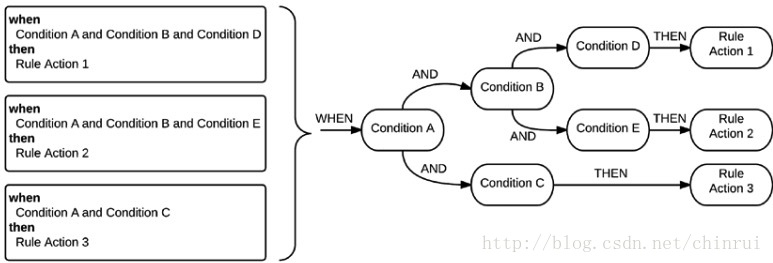

### 基本介绍

#### 概念了解

> 参考：https://blog.csdn.net/chinrui/article/details/74906748

在企业级应用中，诸如欺诈检测软件，购物车，活动监视器，信用和保密应用之类的系统，经常会有大量的、错综复杂的业务规则配置，而且随着企业管理者的决策变化，这些业务规则也会随之发生更改。我们开发人员不得不一直处理软件中的各种复杂问题，不仅需要将所有数据进行关联，还要尽可能快地一次性处理更多的数据，甚至还需要以快速的方式更新相关机制。

##### 规则是什么？

比如，红灯停，绿灯行；苹果会砸向地面；

一句话的事：`当 XXX 的时候，做 XXX 的事`,也就是当满足指定的条件会触发指定的动作，动作会返回一些预期的结果。（抽象化）

```
when 满足什么样的条件
then 最终结果
```

当然，苹果砸向地面只会发生在地球上，换句话说，规则也需要有与之匹配的业务场景。下面要介绍的drools给我们提供了一些基本的`API`，如果要应用，还是要在它基础上进行一些整合开发。

##### 为什么需要使用规则？

如果只是一个或几个逻辑判断，确实没有必要使用规则引擎，命令行语言可以更好地满足我们的需求。然而，业务规则往往是一个庞大且不断变化的规则组合，这使得系统非常复杂，如果只是使用常规代码，则会产生大量的维护工作。

随着业务规则的增长或应用场景的变化，需求会不断地变更，此时，我们可以通过调整规则而使其得到实现。主要是因为业务规则遵循以下原则：

- 它们是独立的
- 它们很容易更新
- 每个规则控制所需的最小信息量
- 它们允许不同背景的人进行合作

##### Drools规则引擎

> 参考：https://www.jianshu.com/p/e713860b128e

能否理解为，策略模式的另一种表达方式？比如，通常我们在学习策略模式时候经常用到的打折销售策略...

`Drools` 基本概念：

- 事实（`Fact`）：对象之间及对象属性之间的关系（数据）

- 规则（`rule`）：是由条件和结论构成的推理语句，一般表示为`when…then`。（执行逻辑）

- 模式（`module`）：就是指IF语句的条件。这里IF条件可能是有几个更小的条件组成的大条件。模式就是指的不能在继续分割下去的最小的原子条件。

`Drools`规则引擎使用包含输入、输出和判断三过程，判断是变化的，而输入和输出是基本固定的，所以适用的场合可以分为下面几种：

1. 输入和输出的参数不变，即：规则文件接收固定的参数，产生固定的输出。比如：根据货物重量计算运输价格，输入参数是货物重量，规则根据级差价格表，输出运输价格；
2. 输入和输出的`JavaBean Object`不变，即：规则文件接收固定类型的`JavaBean`，产生固定类型的`JavaBean`。比如：根据顾客信息和当前购物信息计算优惠价格，输入参数是顾客当前的类别（`VIP`客户等）和当前购物的种类、数量，规则根据顾客类别、商品种类和购买数量输出优惠价格；

**QA**：用规则引擎（`Drools`）要解决的问题是什么？或者`Drools`能解决什么问题？业务的灵活度、业务的复杂度？

#### 语法介绍

> 参考：https://www.jianshu.com/p/ae9a62588da4

- 属性部分：定义当前规则执行的一些属性等，比如是否可被重复执行、过期时间、生效时间等。

- 条件部分，即`LHS`，定义当前规则的条件，如  `when Message()`; 判断当前`workingMemory`中是否存在`Message`对象。

- 结果部分，即`RHS`，这里可以写普通`java`代码，即当前规则条件满足后执行的操作，可以直接调用`Fact`对象的方法来操作应用。



`drl`文件简单编写：

业务场景 1--打折销售

```java
package com.algebra.drools;
import com.algebra.drools.domain.Person;
import com.algebra.drools.domain.Order;
import java.math.BigDecimal;

dialect "java"

rule "年龄大于60岁打九折"
    when
        $person:Person(personAge >= 60)
        $order:Order()
    then
        $order.setDiscount(new BigDecimal("0.9"));
end

rule "年龄大于60岁且购买总数达到3件打八五折"
    when
        $person:Person(personAge >= 60)
        $order:Order(productCount >= 3)
    then
        $order.setDiscount(new BigDecimal("0.85"));
end
```

业务场景 2--会员消费超过1000元，积分翻倍

```java
package com.algebra.test // 命名空间，用于一个包下多个规则

/* 1.依赖导入: 实体类、Util类（函数）、动作执行服务类 */
import com.sky.bluesky.model.fact.TestRule;
import com.sky.bluesky.model.fact.RuleExecutionObject;
import com.sky.bluesky.service.DroolsActionService;

import function com.algebra.aspect.drools.config.Utility.helper;
    
global RuleExecutionResult _result; // 全局变量（向规则提供全局的数据和服务）

/* 2. 规则定义 */
rule "vip_sorce"  // 可以使用中文，推荐英文
    /* 规则属性(关键字) */
    dialect "mvel"
    salience 1 // 规则的优先级
    no-loop true // 设置为true时，当前规则只会被激活一次。
when 
    /* a.条件 */
    $fact:RuleExecutionObject(type=="1")
    $testRule:TestRule(amount>=1000)
    $action:DroolsActionService()
then 
    /* b.动作or结果 */
    _result.getMap().put("message","VIP consumer");
	$testRule.setScore($testRule.getScore()*2);
	$action.execute($fact,_result);
	helper(drools); // 打印日志 或其他 ...
end
```

#### 入门使用

[^ps]: 结合spring boot的demo演示--直接在项目中编写drl文件

需要在`springboot`启动时候注入`DroolsConfiguration`类，配置类中获取`KieServices`、构建`KieFileSystem`、`KieContainer`等，同时需要定义好`drl`文件存放路径。

同时介绍使用`Drools`的一些”小技巧“

### 进阶使用

#### 数据库动态加载规则-1

[^ps]: 结合spring boot的demo演示--模拟读数据库的场景

数据库存储drl的规则文件中文本，每隔文本关联相关业务场景

#### 数据库动态加载规则-2

[^ps]: 结合spring boot的demo演示--细化到规则条件

基于上条更细粒度的规则拆分

#### workbench+maven-nexus动态加载

[^ps]: 结合spring boot的demo演示--单独将规则文件进行编译发布

workbench 的作用其实就是我们写一个maven项目,并且可以通过其打包发布。

> https://blog.csdn.net/a294634473/article/details/89307650
>
> https://blog.csdn.net/xp_zyl/article/details/80648260