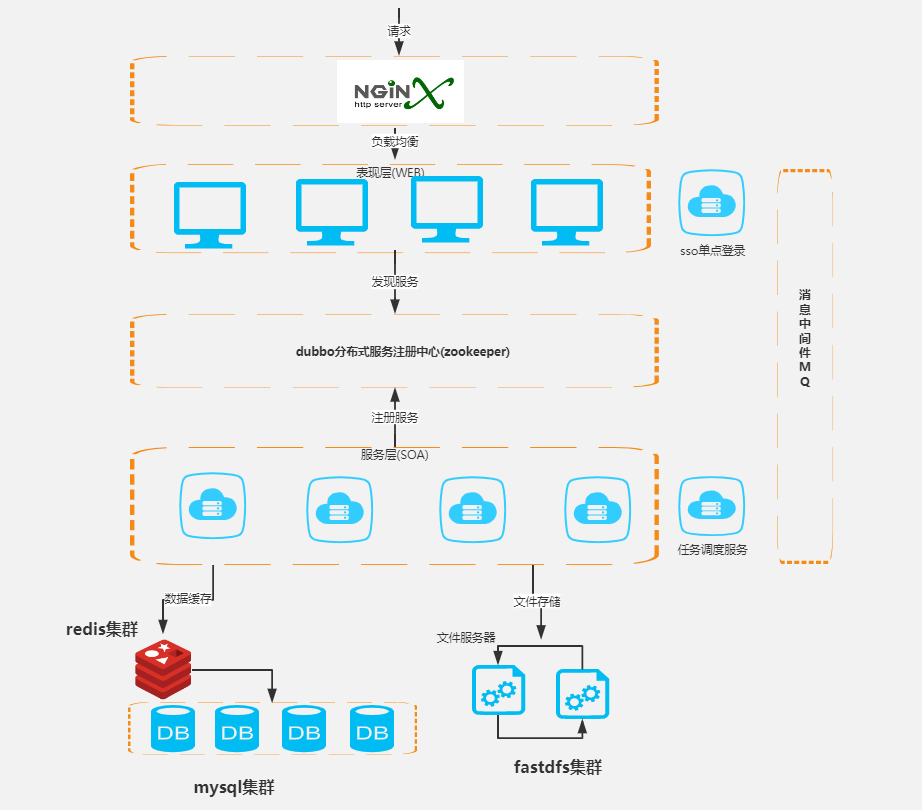
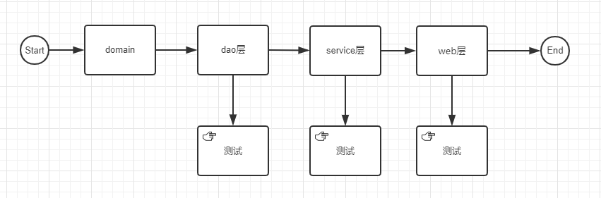

### Spring boot 知识分享

> springboot官网：<https://spring.io/projects/spring-boot/>

springboot 和 react 实现MVC模式

#### 一、简单了解一下微服务架构：

我们在写MVC项目时候的顺序：

> springboot技术栈：<https://www.processon.com/mindmap/5dc1358ce4b0e433945ca671>
>

二、

